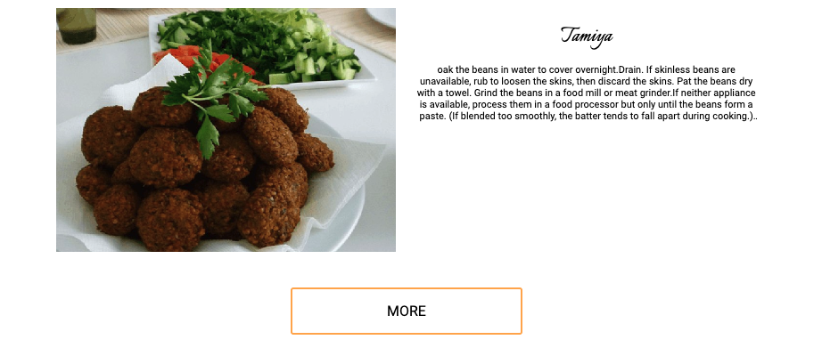
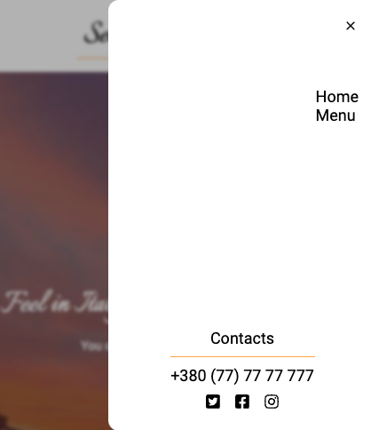

# Test

**Displaying Meals**
The "Menu" page fetches data from an external API and displays the first 5 dishes from the list. The meals are rendered dynamically using a React component.

**Search Functionality**
The search bar allows users to find meals by their names. As users type, a request is sent to the API to fetch and display matching meals.

**Loading Indicator**
A loader is displayed in the interface while waiting for data to be fetched from the API. This enhances user experience by providing feedback during asynchronous operations.

**Error Handling**
The application includes robust error handling. If an error occurs during data fetching (e.g., network issues or invalid API responses), a user-friendly error message is displayed in the interface. This ensures the user is informed and can retry or adjust their input.

1. **Home Page:**

- Includes: navigation, banner, general info, top three meals of the menu, button "MORE" which is capable to load more meals and contact data.

2. **Menu Page:**

- Displays a list of available meals.
- Supports lazy loading of additional meals using a "MORE" - button.
- Includes a search input in order to find the necessary meal.
  
  

3. **Not Found Page**

- Includes user-friendly message indicating the requested page was not found.
- A button to redirect users go back.
  

4. **Adaptation**

- Responsive design has been implemented to ensure seamless adaptation across devices with screen widths ranging from 380px to 1400px.
  
  

## Backend Integration

**API Endpoints:**

- GET /menu: Retrieve all meals.

## Technologies Used

- **Frontend Framework:** React (bundled with Vite).
- **Routing:** React Router.
- **HTTP Requests:** Axios.
- **Styling:** CSS Modules.
- **Notifications:** react-hot-toast.

## Installation

1. Clone the repository: git clone
   `https://github.com/PrysiazhnaIra/test.git`

2. Install dependencies: `npm install`

3. Start the development server: `npm run dev`

4. Open your browser and navigate to `http://localhost:5173.`

## Deployment

The project is deployed and accessible at:

- Live Demo: [Test](https://test-tau-seven-62.vercel.app/)

## Author

- Name: Ira Prysiazhna
- [My GitHub Profile URL](https://github.com/PrysiazhnaIra)
- [My LinkedIn Profile URL](https://www.linkedin.com/in/ira-prysiazhna/)
